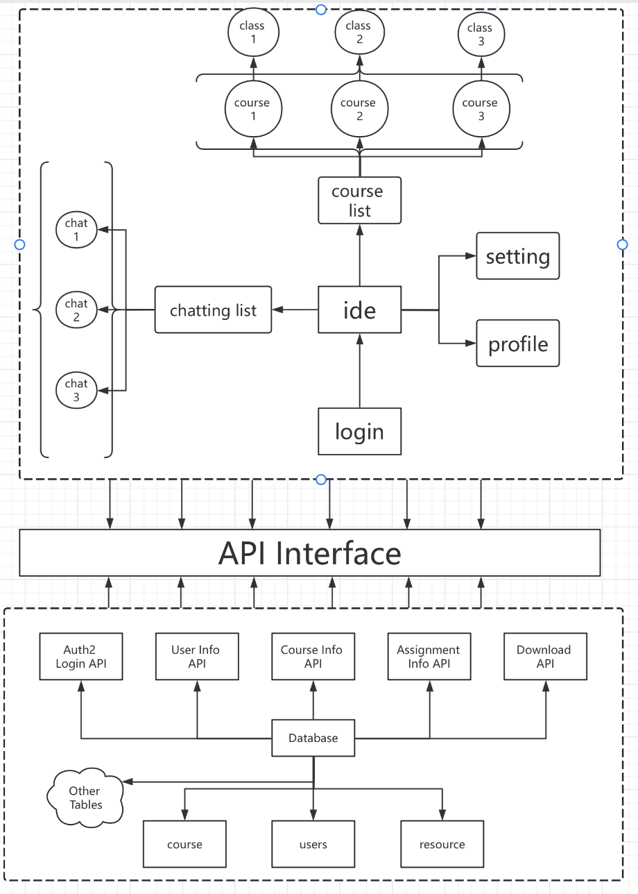
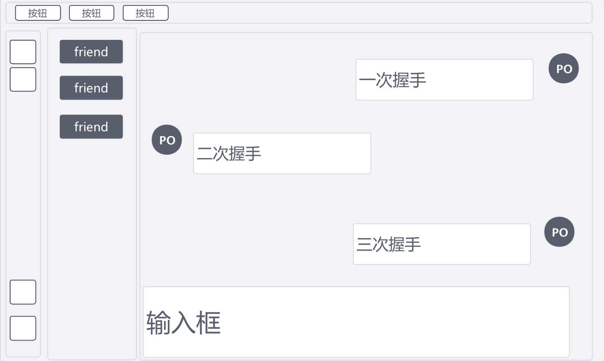
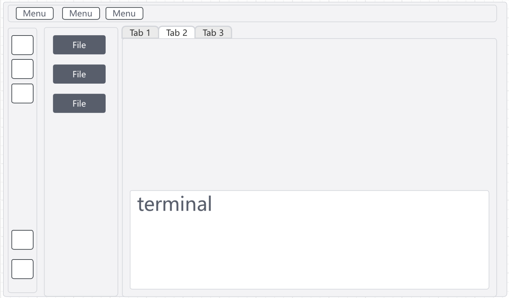
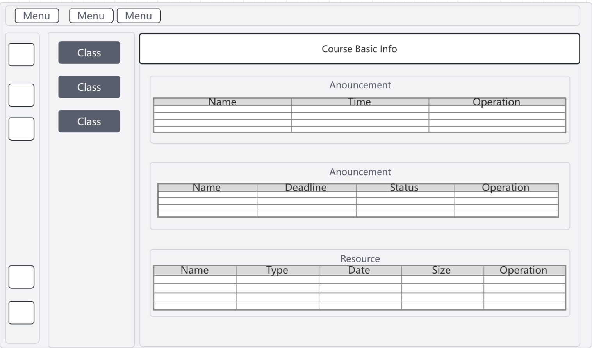
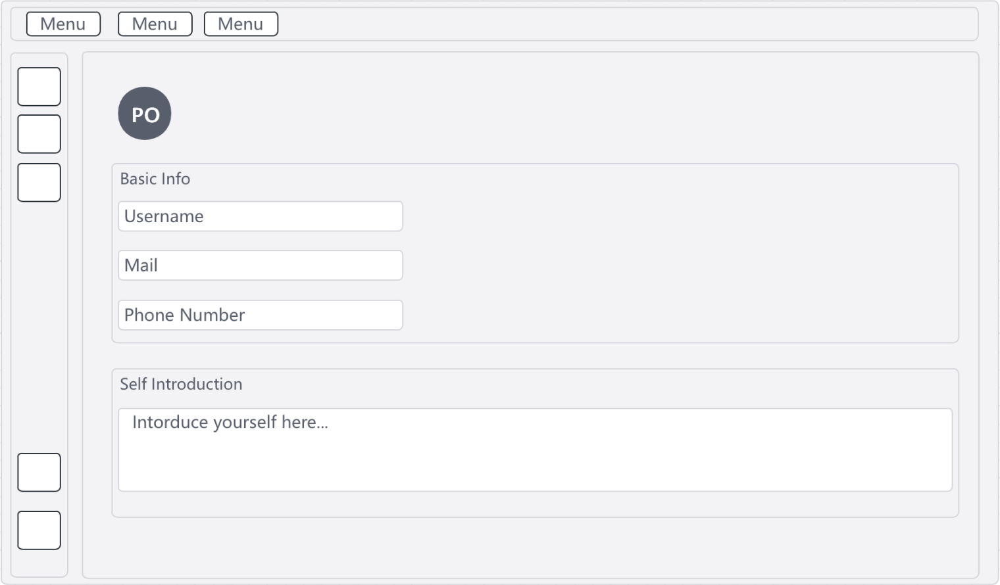

# team-42 Sprint 1 report

## 1. Architecture

### 1.1 Frontend structure

#### 1.1.1. User Authentication Module (`login/`)

A secure entry point for user authentication, interfacing with the backend to verify credentials.

- **Logic**:  
  - Calls the `Auth2 Login API` and stores JWT in `localStorage`.  
  - Global route guards (to block unauthorized access).  

#### **1.1.2. Course Management Module (`course/`)**

 Users can access various courses, each represented as a distinct module, making navigation seamless.

- **Logic**:  
  - Fetches data via the `Course Info API` and caches state in `stores/courses.js`.  

#### **1.1.3. Real-Time Chat Module (`chat/`)**

A built-in chat feature enables real-time communication, ideal for collaboration or Q&A within courses.

- **Logic**:  
  - WebSocket connection (independent of REST API).  
  - Messages stored in `stores/chat.js` with offline caching support.  

#### **1.1.4. IDE Module (`ide/`)**

For programming courses, we’ve integrated an IDE, allowing users to write and test code directly in the app.

- **Logic**:  
  - Interacts with the backend `Download API` for file save/load operations.  

#### **1.1.5. User Profile Module (`profile/`)**

Users can manage their personal details and preferences, ensuring a tailored experience.

**Logic**:  

- Interacts with the backend `User info API` for file save/load user info.  

### 1.2 backend structure

#### **1.2.1 APIs**

| API                     | Description                                                  |
| :---------------------- | :----------------------------------------------------------- |
| **Auth2 Login API**     | Manages user authentication, likely using OAuth2 for secure login. |
| **User Info API**       | Handles user data, such as profile updates.                  |
| **Course Info API**     | Retrieves course details, like syllabi or schedules.         |
| **Assignment Info API** | Manages assignment submissions and grading.                  |
| **Download API**        | Enables users to download resources, such as lecture notes.  |

#### **1.2.2 Database**

- **Tables**:
    - `Users`: Stores user account and profile data.
    - `Course`: Contains course-related information.
    - `Resource`: Manages downloadable resources (e.g., files, notes).
    - **Other Tables**: Additional structures for extended functionality (e.g., enrollments, assignments).
- **Interactions**:
    - Each API interacts with specific tables to fetch or update data.
    - Ensures efficient and consistent data management.

#### **1.2.3 Design Rationale**

- **Scalability**: Modular APIs allow independent scaling of components.
- **Maintainability**: Clear separation of concerns simplifies updates and debugging.
- **Data Consistency**: Relational database design ensures integrity for critical relationships (e.g., user-course mappings).

#### 1.2.4 Why This Architecture?

The modular design—distinct frontend components and APIs—**makes it easy to add features** (e.g., a quiz module) without disrupting existing functionality. 

The relational **database** supports complex queries, essential for an educational platform managing interconnected data like users, courses, and assignments.

This desktop application is designed to empower users with a seamless, all-in-one educational tool, and I’m confident our architecture sets a strong foundation for both **current needs and future growth.**

## 2. UI design

Our UI design philosophy is to **try to keep the frame and only change the content when switching pages.** Based on the framework we have already designed, we keep the contents bar, toolbar, and item selection bar structure unchanged between the different main pages, only changing the page displayed in the right box.

