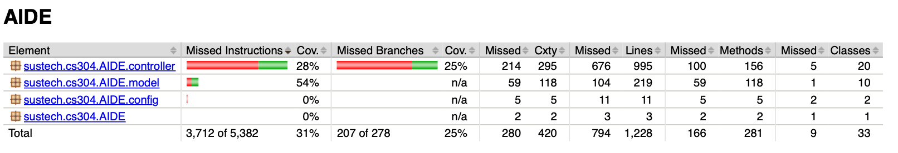
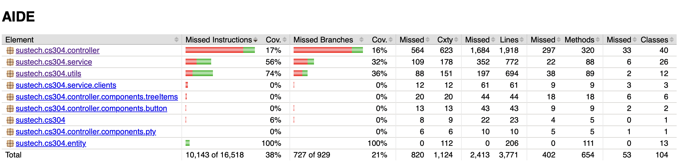
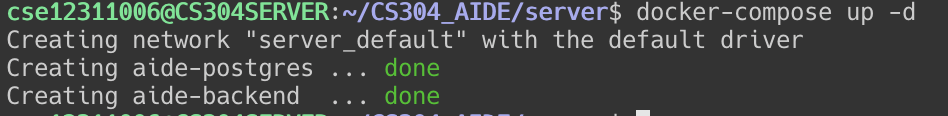

# Report 2

## Metrics

|         Metric         | Client | Server |
| :--------------------: | :----: | :----: |
|     Lines of Code      | $7333$ | $2662$ |
| Number of source files |  $56$  |  $35$  |
| Cyclomatic complexity  | $968$  | $405$  |
| Number of dependencies | $115$  |  $98$  |

Count Tools and Commands:

* Lines of Code:

  ```bash
  cloc src/
  ```

* Number of source files

  ```bash
  find src/main/java -name "*.java" | wc -l
  ```

* Cyclomatic complexity

    ```bash
  lizard src/
  ```

* Number of dependencies

    ```bash
  mvn dependency:list | grep -c '^\[INFO\]    '
  ```

## Documentation

Our documentation is in [🔗](https://sustech-cs304.github.io/team-project-25spring-42/)

## Test

* **Tools/Framework**: JUnit and Jacoco

* **Source Code**: [📁](https://github.com/sustech-cs304/team-project-25spring-42/tree/main/client/src/test/java/sustech/cs304) and [📁](https://github.com/sustech-cs304/team-project-25spring-42/tree/main/server/src/test/java/sustech/cs304/AIDE)

* **Effectiveness**:

  * Server:

    
  
  * Client:
  
    
  

## Build

* **Tools:**
  * Maven
  * Maven Shade Plugin
* **Tasks executed in a build:** introduced in [document](https://sustech-cs304.github.io/team-project-25spring-42/docs/intro).

* **The final artifacts:**
  * Client: `AIDE.dmg` (macos) and `AIDE.zip` (windows) see [release](https://github.com/sustech-cs304/team-project-25spring-42/releases/tag/v1.0.0)
  * Server: `AIDE.jar`

* **Buildfile**:
  * Client: [📁](https://github.com/sustech-cs304/team-project-25spring-42/blob/main/client/pom.xml)
  * Server: [📁](https://github.com/sustech-cs304/team-project-25spring-42/blob/main/server/pom.xml)

## Deployment

* **Tools:**

  * Docker

  * Docker Compose

* **Related Artifacts:**

  * `Dockerfile`: [📁](https://github.com/sustech-cs304/team-project-25spring-42/blob/main/server/Dockerfile)
  * `docker-compose.yml`: [📁](https://github.com/sustech-cs304/team-project-25spring-42/blob/main/server/docker-compose.yml)

* **Snapshot:**

  
